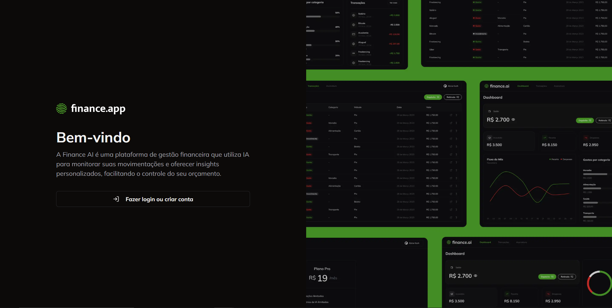
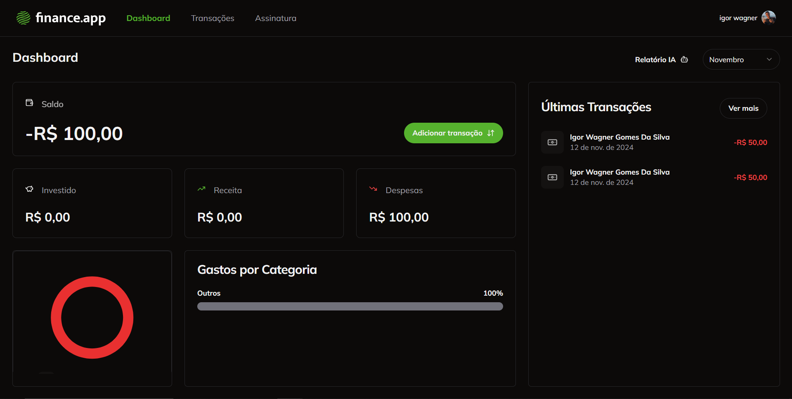
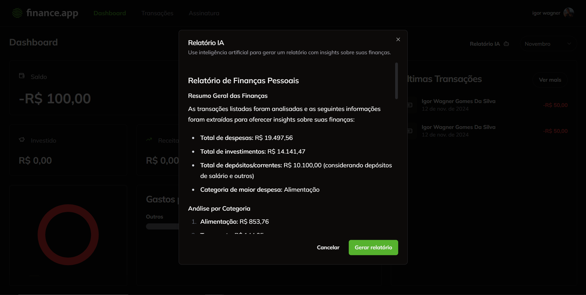

# 💰 finance.app

Bem-vindo ao **finance.app**! Este é um projeto desenvolvido com **Next.js**, que utiliza **Clerk** para autenticação, **Tailwind CSS** para estilização, **Shadcn** para componentes de IU, e **Stripe** para pagamentos. Além disso, aproveitamos a **API da OpenAI** para gerar relatórios inteligentes e detalhados. 🚀

## 🚀 Tecnologias Utilizadas

- **Next.js**: Framework React para criação de sites e aplicações web.
- **Clerk**: Autenticação segura e gerenciamento de usuários.
- **Tailwind CSS**: Estilização rápida e responsiva.
- **Shadcn**: Conjunto de componentes estilizados para uma IU intuitiva.
- **Stripe**: Processamento de pagamentos seguro e flexível.
- **OpenAI API**: Geração de relatórios com IA para insights financeiros inteligentes.

## 🌟 Funcionalidades Principais

- **Autenticação de Usuário** 🔐: Fácil login com o Clerk.
- **Pagamentos Seguros** 💳: Plano premium com Stripe.
- **Relatórios Inteligentes** 📈: Insights detalhados usando a IA da OpenAI.
- **Interface Customizável** 🎨: UI responsiva e estilosa com Tailwind CSS e Shadcn.

## 📸 Screenshots

| Tela de Login | Tela de Relatórios |
| --- | --- |
|  |  |

## ⚙️ Como Executar o Projeto

1. Clone o repositório:]
   
   ```bash
   git clone https://github.com/seuusuario/finance.app.git
   Clone o repositório:
   ```
3. Instale as dependências:
   
   ```bash
   cd finance.app
   npm install
   ```
5. Configure as variáveis de ambiente:
   
  - Crie um arquivo ```.env.local``` na raiz do projeto com as seguintes informações:
   ```bash
   NEXT_PUBLIC_CLERK_FRONTEND_API=<sua_clerk_api>
  STRIPE_SECRET_KEY=<sua_stripe_secret_key>
  OPENAI_API_KEY=<sua_openai_api_key>
  ```
4. Inicie o projeto:
   
 ```bash
   npm run dev
```
5. Acesse o app:
  -Abra o navegador e vá para http://localhost:3000


## 💳 Plano Premium
Para desbloquear todos os recursos do **finance.app**, você pode optar pelo nosso **Plano Premium**. Com ele, você terá acesso a relatórios avançados, insights mais detalhados e suporte prioritário! 🎉

##  🛠️ Estrutura do Projeto

  ```bash
├── components      # Componentes reutilizáveis do projeto
├── pages           # Páginas do Next.js
├── public          # Arquivos públicos (imagens, ícones, etc.)
├── styles          # Estilos customizados
└── utils           # Funções utilitárias e helpers
  ```

## 🤖 Usando a API da OpenAI
A API da OpenAI é usada para gerar relatórios dinâmicos com base nas suas transações cadastradas. Com isso, você terá insights detalhados, dicas de economia e muito mais!
 

## 🛠️ Configurações Extras

Certifique-se de que você já tem:

- Uma conta no **Clerk** para autenticação 🔑.
- Uma conta no **Stripe** para habilitar os pagamentos premium 💳.
- A **API Key** da **OpenAI** para usar relatórios de IA 🤖.


## 📄 Licença

Este projeto é licenciado sob a [MIT License](LICENSE).


